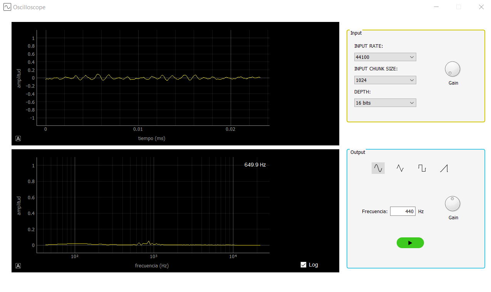
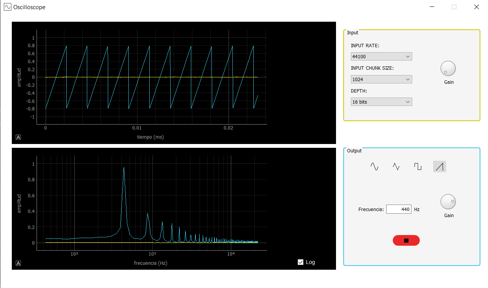

# Osciloscopio

Este proyecto es un trabajo para la asignatura de Física Experimental II en el Instituto Balseiro, Argentina.

### Introcucción
El objetivo de este trabajo es utilizar el sistema de audio de la computadora para:
- generar ondas de sonido de frecuencia y amplitud ajustable con forma de onda 
	- senoidal,
	- cuadrada,
	- triangula,
	- y diente de cierra;
- captar sonido y mostrarlo en tiempo real junto con el espectro en frecuencia.

En este proyecto se utilizó python con este fin. Los paquetes utilizados se detallan en  el fichero `requirements.txt`. Puede crear un entorno virtual de python con los módulos necesarios con las liguientes líneas de comando:
```sh
$ virtualenv <env_name>
$ source <env_name>/bin/activate
(<env_name>)$ pip install -r path/to/requirements.txt
```

Uno de los múdulos utilizados (y probablemente el fundamental) es [PyAudio](https://people.csail.mit.edu/hubert/pyaudio/docs/), durante su instalación en Windows 10 me econtré con inconvenientes instalándolo directamente de los repositorios de pip; si tiene el mismo problema [esto](https://stackoverflow.com/questions/52283840/i-cant-install-pyaudio-on-windows-how-to-solve-error-microsoft-visual-c-14) puede serle útil.

### Estructura del proyecto

El proyecto consiste de 4 ficheros fundamentales:

- `main.py` es el fichero principal como indica el nombre, aquí se instancian las clases necesarias y se corre el programa;
- `mainwindow.ui` es el archivo XML que contiene el diseño y estilo de la ventana principal de la aplicación;
- `audio.py` que contiene las clases para la captura y el procesamiento del audio;
- y `plot.py` que contine las clases para el mostrar las señales y datos en la ventana  principal.

Para la interfaz gráfica se utilizó [Qt](https://www.qt.io/), para poder presentar la información sin mucha latencia. El archivo ```mainwindow.ui``` fue creado utilizando el programa de interfaz gráfica [Qt Creator 4.12.4 (Community)](https://www.qt.io/product/development-tools) por lo que no detallaré en este.

### `plot.py`

Para graficar las señales y sus transformadas se utilizó el módulo [pyqtgraph](http://www.pyqtgraph.org/) .

###### `Plot`

```python
import PyQt5
from pyqtgraph import PlotWidget
import pyqtgraph as pg
import numpy as np

class Plot(PlotWidget):
	''' Plot class with handy methods to display the signal inside the oscilloscope '''
	
	#...
```

Los gráficos en la aplicación se implementan en la clase `Plot` que hereda de la clase `pyqtgraph.PlotWidget`. En este caso solo se utiliza la herencia para incomporar una opción de mostrar en un label de Qt la pocisión del mouse en caso de estar encima del área del gráfico.
###### `Channel`
```python
class Channel:
	''' A class for the signal channels of the oscilloscope, to put together the adquisition and processing with the visual display '''

	def __init__(self, time_plot, freq_plot, stream, color):
		#...
```

Luego se implementa la clase `Channel` a la cual se le pasan dos instancias de la clase `Plot` que será donde se mostrará la señal y su espectro, una instancia de la clase `Stream` que se implementó en `audio.py` y de la cual se hablará luego, y un string que representa el color (en hezadecimal o posiblemente un color nombrado válido en Qt) con que se quiere mostrar la señal.

```python
		#continuación de Channel.__init__()

		# create line in each plot
		self.time_line = time_plot.plot(self.t, np.zeros(len(self.t)), pen=pg.mkPen(color))
		self.freq_line = freq_plot.plot(self.f, np.zeros(len(self.f)), pen=pg.mkPen(color))

		#...
```

Cuando se inicializa un `Channel` se crea una línea nueva en cada `Plot` para los datos que llegan desde `stream`. Estas líneas se actualizan cada vez que es necesario utilizando el método privado `_update()`

```python
	#... continuación de la clase Channel

	def _update(self, time, freq):
		_f_abs = np.abs(freq)
		# _f_real = np.real(freq)
		# _f_img = np.imag(freq)

		self.time_line.setData(self.t, time)
		self.freq_line.setData(self.f[:len(freq)], _f_abs)
```

### `audio.py`

###### `Process`

Aquí es donde se hace la adquisición y procesamiento del sonido. Se creó la clase `Process` que contiene los métodos importantes de procesamiento de las señales. Esta clase hereda de `PyQt5.QtCore.QObject` para poder emitir señales de `PyQt5.QtCore.pyqtSignal`.

```python
from PyQt5.QtCore import QObject, pyqtSignal
import numpy as np
import struct
import pyaudio
import threading
from scipy.signal import find_peaks

class Process(QObject):
	''' Process class that implements the interperetation and prossesing of the data from stream'''

	#...

	def get_ndarray_data(self, in_data, frame_count, format):
		_format = self.struct_types[format]
		_amp = 2 ** (self.amp[format] - 1)
		
		_raw_data = np.array(struct.unpack(str(frame_count) + _format, in_data))
		
		return _raw_data / _amp

	#...
```
El método `get_ndarray_data` recibe la señal como un string binario, la convierte en un `ndarray` de `numpy` y la normaliza a 1. Para desempaquetar la cadena binaria es necesario saber cómo esta codificada, esto se pasa mediante el parámetro `format` y se lleva al formato requerido por `struct` mediante el diccionario `struct_types`.

```python
	#... continuación de la clase Process

	def fft(self, time_data):
		# size of the chunk (always an even one)
		_size = len(time_data)

		_fft = np.fft.fft(time_data)[1:_size // 2] * (4 / _size)
		
		return  _fft
```

El método `fft` recibe un arreglo con la señal en el dominio de la frecuencia y devuelve un arreglo complejo con la __Transformada Discreta de Fourier__. De todas las frecuencias que calcula la función `numpy.fft.fft` solamente se devuelven los valores positivos, que son los de interés, no hay información nueva en los demás.

###### `InputStream`

```python
class InputStream(Process):
	'''Input Stream class'''

	sig_new_data = pyqtSignal(np.ndarray, np.ndarray)

	def __init__(self, pyaudio_object, chunk=1024, rate=44100, format=pyaudio.paInt16, channels=1):
		Process.__init__(self)

		#...

		self.stream = pyaudio_object.open(
			format=self.format,
			channels=self.channels,
			frames_per_buffer=self.chunk,
			input=True,
			rate=self.rate,
			stream_callback = self.callback
		)

		#...	

```

La clase `InputStream`, que hereda de `Process` implementa un stream de entrada da audio a partir de los parámetros pasados:

- `chunk` es la cantidad de _frames_ del búfer de audio,
- `rate` es la cantidad de _frames_ que se toma por segundo,
- `format` es el formato en que se lee la señal que establece la profundidad con que se hace la conversión analógica - digital en el **ADC** del sistema,
- `channels` es la cantidad de canales de la entrada (1: mono, 2: stereo, etc).

Este stream se puede utilizar de dos formas diferentes: _Blocking Mode_ con el cual la captura del audio se produce en la misma línea de ejecución que el resto de la aplicación y _Callback Mode_ que realiza la adquisición y procesa la información en una línea diferente de procesamiento. La mejor opción para evitar que la captura de audio se vea interrumpida por los demás porcesos de la aplicación es la de _Callback_. En la creacción del stream, el parámetro `stream_callback` recibe una función que será llamda cuando se haya adquirido suficientes datos (o se hayan repoducido los que se enviaron en caso de ser un stream de salida).

```python
	#... continuación de la clase InputStream
	def callback(self, in_data, frame_count, time_info, status):
		_time_data = self.get_ndarray_data(in_data, frame_count, self.format)
		_fft = self.fft(_time_data)

		self.sig_new_data.emit(_time_data, _fft)

		return (in_data, pyaudio.paContinue)

```

La función `calback` recibe la data adquirida en formato binario, junto con la cantidad de frames e información extra sobre el tiempo y el estado de repodrucción. Es aquí donde se desempaqueta esta información y se calcula la transformada discreta de fourier de la señal. Se puediera entonce llamar aquí a la función para actualizar los gráficos del `Channel`, sin embargo esto presenta algunos inconvenienes, pues esta función de callback es llamada en un nuevo hilo de ejecución y puede hacer que el programa eventualmente deje de funcionar por colisión de procesos. Es por esto que se implmentó la conexión a través de las señales de Qt `pyqtSignal` (para lo cual se había hecho heredar de la clase `QObject`). 

```python
class InputStream(Process):
	'''Input Stream class'''

	sig_new_data = pyqtSignal(np.ndarray, np.ndarray)
	#...
```

La clase `InputStream` posee una señal llamada `sig_new_data` que lleva dos `ndarray` de `numpy`. Cuando en la función `callback` se obtiene la señal en forma de arreglo y se calcula la transformada de Fourier, se emite esta señal con estos últimos datos como parámetros, haciendo segura la comunicación entre los dos hilos de ejecución.

```python
		#... Channel.__init__()

		stream.sig_new_data.connect(self._update)

		#...
```

Cuando se inicializa la clase `Channel`, se conecta la señal `sin_new_data` del `stream` pasado con su método `_update` de modo que cada vez que el stream tenga datos nuevos, se procesarán y luego serán enviados a graficar en el hilo principal de la aplicacion sin interferir en la captura del audio.

###### `OutputStream`

```python
class OutputStream(Process):
	'''Output stream class'''

	sig_new_data = pyqtSignal(np.ndarray, np.ndarray)


	def __init__(self, pyaudio_object, chunk=1024, rate=44100, format=pyaudio.paFloat32, channels=1):
		Process.__init__(self)

		#...

		self.stream = pyaudio_object.open(
			format=self.format,
			channels=self.channels,
			frames_per_buffer=self.chunk,
			output=True,
			rate=self.rate
		)

		#...
```

Para la implementación del stream de salida se crea un stream de modo parecido a como se hace en la clase `InputStream` a diferencia que en este caso no se utilizó la opción de callback pues daba resultados inesperados.

```python
	#... continuación de la clase OutpuStream

	def triangular_wave(self, freq, t):...

	def sawtooth_wave(self, freq, t, slope=1):...

	def square_wave(self, freq, t):...

	def sin_wave(self, freq, t):...

	def set_gain(self, gain):...

	def set(self, freq=440, wave_form='sin'):
		wave_function = {
			'sin': self.sin_wave,
			'triangular': self.triangular_wave,
			'square': self.square_wave,
			'sawtooth': self.sawtooth_wave
		}
		_duration = 0.2
		_t = np.arange(0, _duration, 1/self.rate)
		self.data = 2 ** ( self.amp[self.format] - 1) * wave_function[wave_form](freq, _t)

		#...
```

Se definieron funciones para generar al audio que se quiere enviar a los parlantes y una función set para establecerlos.

```python
	#... continuación de la clase OutputStream

	def play(self):
	def _play():
		while self.playing_state:
			_t, _f = self.get_x_range()
			_data = self.data * self.gain
			_fft = self.fft(_data[:len(_t)] / ( 2 ** ( self.amp[self.format] - 1)))
			
			self.sig_new_data.emit(_data[:len(_t)] / ( 2 ** ( self.amp[self.format] - 1)), _fft )
			self.stream.write(_data.astype(int))
	
	play_th = threading.Thread(target=_play, args=())
	self.playing_state = True
	play_th.start()

	def stop(self):
		self.playing_state = False
```

Para implementar la reproducción del sonido era necesario que este lo hiciera en una línea de ejecución que no fuese la principal, en caso de que fuera así se dentendría todo lo demás haciendo el resto de la aplicación inútil. Para esto se creó un hilo de ejecución nuevo utilizando `threading.Thread` que una vez inicial ejecuta un ciclo infinito de reproducción de la señal hasta tanto no se llame al método `stop()` que detiene el loop.

### `main.py`

###### `MainWindow`

Aquí se implementa la clase `MainWindow` que hereda de `PyQt5.QtWidgets.QMainWindow` que será la ventana principal de la aplicación.

```python
		#... MainWindow.__init__()
		uic.loadUi(ui_file, self)
```

En la inicialización se carga el archivo `.ui` que contiene los widgets y elementos de la ventana, así cómo algunos elementos de estilo.

```python
		self.time_plot = self.findChild(Plot, 'timeGraph')
		self.freq_plot = self.findChild(Plot, 'freqGraph')
```

Se cargan los `Plot` de la señal en el domino del tiempo y de frecuencia.

```python
		self.p = pyaudio.PyAudio()
		self.chunk = 1024
		self.rate = 44100
		self.format = pyaudio.paInt16
		self.out_freq = 440
		self.wave_form = 'sin'
		self.create_input_stream()
		self.create_output_stream()
```

Se instancia un objeto `pyaudio.PyAudio`, se establecen los parámetros iniciales de los streams y se crean los streams de salida y entrada.

```python
		self.ch2 = Channel(self.time_plot, self.freq_plot, self.out_stream, '#3dc6e4')
		self.ch1 = Channel(self.time_plot, self.freq_plot, self.in_stream, '#f4e923')
```

Se crean los canales para cada una de las señales. Y luego se cargan y conectan los elementos de la ventana principal con sus respectivas funciones.

###### Ejecución

```python
#######################
# QtApplication
#######################
app = QtWidgets.QApplication([])

#######################
# Main Window 
#######################
main = MainWindow('mainwindow.ui')

# Display de widget 
main.show() 

# Start the Qt event loop
app.exec_()

# Close streas & terminate PyAudio
main.close_input_stream()
main.terminate_pyaudio()
```

La ejecución de la aplicación sucede en este último pedazo de código; se crea la `QtWidgets.QApplication` que es la encargada de correr el loop principal y manejar los eventos y señales. se crea una instancia de `MainWindow` con el archivo de `mainwindow.ui`, se muestra y se inicia la aplicación. 

Una vez cerrada la aplicación de Qt se cierran los streams y se termina la instancia de `pyaudio.PyAudio`

### Interfaz



A la parte izquierda se tienen los gráficos y a la derecha los controles. De la captura de audio se puede modificar los parámetro del `rate`, el `chunk`, y el `format`, así com la ganancia.



Por los controles de salida se puede regular el tipo de onda, la frecuencia y ganancia, así como el estado de reproducción.